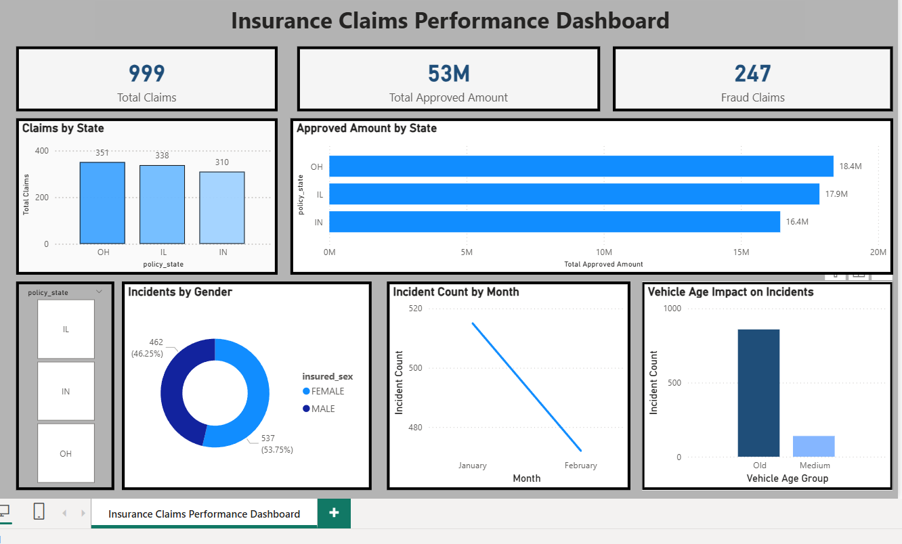

# CODTECH-TASK3-DASHBOARD
CODTECH Internship Task-3: Interactive Dashboard using Power BI for Insurance Claims Analysis
# CODTECH Internship Task-3

## Interactive Dashboard Development

## Objective

This project focuses on creating an interactive dashboard using Power BI to analyze insurance claims data.

## Dataset

Insurance Claims Dataset

## Tools Used

* Power BI
* Microsoft Excel / CSV
* Data Visualization Techniques

## Dashboard Features

* Total Claims KPI
* Total Approved Amount KPI
* Fraud Claims KPI
* Claims by State
* Approved Amount by State
* Incidents by Gender
* Monthly Trend Analysis
* Vehicle Age Impact Analysis
* Interactive Filters

## Key Insights

* Ohio (OH) has the highest number of claims
* Approved amount is highest in OH state
* Female claims are slightly higher than male
* Old vehicles show more incidents

## Dashboard Screenshot

## Author

Chandrakant
Data Analytics Intern – CODTECH
